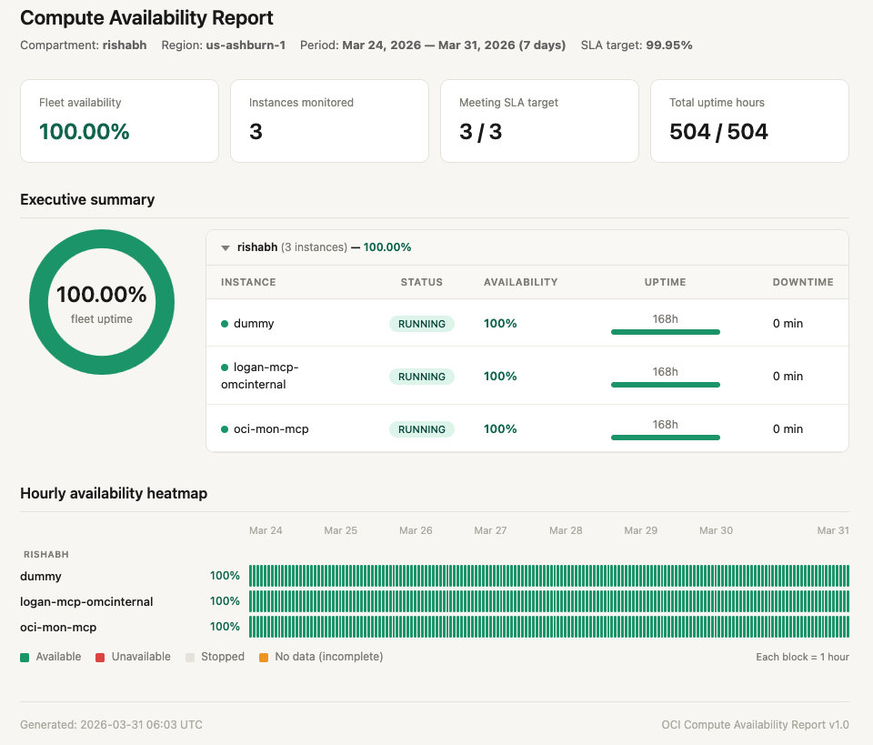

# OCI Compute Availability Report

A single-file Python CLI tool that generates self-contained HTML availability reports for OCI Compute VM instances. Built for MSP/partner operations teams who need to prove compute uptime for SLA-based contractual payments.

The tool queries two OCI Monitoring metrics (CpuUtilization and instance_status), computes per-instance, per-compartment, and fleet-level availability percentages, and renders an offline-capable HTML report with interactive charts and heatmaps.



## Prerequisites

- **OS:** Oracle Enterprise Linux 9 (OEL 9), Oracle Linux 8, or any Linux with Python 3.8+
- **Python:** 3.8 or later with pip
- **OCI Python SDK:** `pip3 install oci`
- **git:** for cloning the repository
- **IAM policies** granting read access to instances, metrics, and compartments (see [IAM Setup](#iam-setup))
- **OCI Compute instances** with the monitoring agent enabled

## Quick start — fresh OEL 9 VM

The fastest way to get started on a fresh OCI VM (OEL 9):

```bash
# One-line setup: installs git, python3, oci SDK, clones repo, runs tests
curl -sL https://raw.githubusercontent.com/rishabh-ghosh24/devspace/sla-report/monitoring/sla-report/scripts/setup_oel9.sh | bash
```

Or step by step:

```bash
# 1. Install system dependencies
sudo dnf install -y git python3 python3-pip

# 2. Install OCI Python SDK
pip3 install --user oci

# 3. Clone and checkout
git clone https://github.com/rishabh-ghosh24/devspace.git
cd devspace
git checkout sla-report
cd monitoring/sla-report

# 4. Verify setup
python3 -m pytest tests/ -v
```

## Quick start — generating reports

```bash
cd ~/devspace/sla-report

# Generate a 7-day report using OCI config file auth
python3 compute_availability_report.py \
  --auth config --profile DEFAULT \
  --compartment-id ocid1.compartment.oc1..aaaa...

# Generate a 30-day tenancy-wide report
python3 compute_availability_report.py \
  --auth config --profile DEFAULT \
  --compartment-id ocid1.tenancy.oc1..aaaa... \
  --days 30

# Using Instance Principals (on OCI VM with dynamic group)
python3 compute_availability_report.py \
  --compartment-id ocid1.compartment.oc1..aaaa...
```

The report is saved as `availability_report_<compartment>_<YYYYMMDD_HHMM>.html` in the current directory. Open it in any browser -- no internet connection required.

## CLI reference

```
compute_availability_report.py [OPTIONS]
```

### Required

| Flag | Description |
|------|-------------|
| `--compartment-id OCID` | Target compartment OCID. Can be a tenancy root OCID to scan all compartments. |

### Authentication

| Flag | Default | Description |
|------|---------|-------------|
| `--auth {instance_principal,config}` | `instance_principal` | Authentication method. Use `config` for local development. |
| `--profile NAME` | `DEFAULT` | OCI config file profile name (only used with `--auth config`). |

### Reporting

| Flag | Default | Description |
|------|---------|-------------|
| `--days {7,14,30,60,90}` | `7` | Reporting period in days. Maximum 90 days (OCI hourly retention limit). |
| `--sla-target FLOAT` | `99.95` | SLA target percentage for compliance comparison. |
| `--running-only` | off | Only include currently RUNNING instances. By default, all non-TERMINATED instances are included. |
| `--region REGION` | from auth | OCI region override. |
| `--compartment-name TEXT` | auto-detected | Override the compartment display name shown in the report header. |

### Branding

| Flag | Description |
|------|-------------|
| `--title TEXT` | Custom title displayed in the top-right header area (e.g., "ACME Corp MSP"). |
| `--logo PATH` | Path to a logo image file. Embedded as base64 in the report for offline use. |

### Exclusions

| Flag | Description |
|------|-------------|
| `--exclude NAME [NAME ...]` | Instance names or OCIDs to exclude from the report. |
| `--exclude-file PATH` | Path to a file with instance names/OCIDs to exclude (one per line, `#` for comments). |

### Output

| Flag | Default | Description |
|------|---------|-------------|
| `--output PATH` | auto-generated | Custom output file path for the HTML report. |
| `--upload` | off | Upload the report to OCI Object Storage after generation. |
| `--bucket NAME` | `availability-reports` | Object Storage bucket name (created automatically if it does not exist). |
| `--os-namespace NS` | auto-detected | Object Storage namespace override. |
| `--par-expiry-days INT` | `30` | Pre-Authenticated Request (PAR) link expiry in days. |

### Example commands

```bash
# Weekly report for a compartment subtree (Instance Principals on a VM)
python3 compute_availability_report.py \
  --compartment-id ocid1.compartment.oc1..aaaa...

# Tenancy-wide 30-day report with Object Storage upload
python3 compute_availability_report.py \
  --compartment-id ocid1.tenancy.oc1..aaaa... \
  --days 30 --upload --bucket sla-reports

# Config file auth, custom SLA, MSP branding
python3 compute_availability_report.py \
  --auth config --profile PROD \
  --compartment-id ocid1.compartment.oc1..aaaa... \
  --days 90 --sla-target 99.99 \
  --title "ACME Corp MSP" --logo /path/to/logo.png

# Custom output path with 90-day PAR
python3 compute_availability_report.py \
  --compartment-id ocid1.compartment.oc1..aaaa... \
  --days 30 --upload --par-expiry-days 90

# Exclude specific instances by name
python3 compute_availability_report.py \
  --compartment-id ocid1.compartment.oc1..aaaa... \
  --exclude "test-vm" "dev-sandbox"

# Exclude instances from a managed file
python3 compute_availability_report.py \
  --compartment-id ocid1.compartment.oc1..aaaa... \
  --exclude-file exclude.list
```

### Exclusion file format

Create a plain text file with one instance name or OCID per line. Lines starting with `#` are comments:

```
# exclude.list — instances to exclude from SLA reports
# Test and development instances
test-vm-staging
dev-sandbox

# Specific instance by OCID
ocid1.instance.oc1.iad.aaaa...example
```

## Report sections

The generated HTML report includes the following sections:

### Metric cards

Four summary cards at the top of the report:

| Card | Description |
|------|-------------|
| Fleet availability | Overall availability percentage across all instances. Color-coded: green (meets SLA), amber (>= 99%), red (below 99%). |
| Instances monitored | Total number of VM instances included in the report. |
| Meeting SLA target | Count of monitorable instances (excludes stopped/N/A) meeting or exceeding the configured SLA target. |
| Total uptime hours | Aggregate uptime hours out of total monitored hours. |

### Summary table

A per-instance breakdown grouped by compartment. Each compartment group is **collapsible** — click the arrow to expand or collapse. The header shows compartment name, instance count, and compartment-level availability. Within each group, instances are sorted worst-availability-first.

When using a tenancy root OCID, the report header shows `Compartment: <name> (tenancy)` to indicate tenancy-wide scope.

Columns: Instance name, lifecycle status (colored badge), availability percentage, uptime hours (with stacked bar showing up/down/stopped distribution), and downtime.

### Availability heatmap

A visual timeline showing per-instance availability over the reporting period. Each row represents one instance, with colored blocks indicating hourly status:

- **Green** -- available (instance running and healthy)
- **Red** -- unavailable (infrastructure issue detected)
- **Light gray** -- stopped (instance not running; excluded from availability calculation)
- **Amber/hatched** -- no data (query failure; triggers N/A availability)

Block resolution adapts to the reporting period: 1-hour blocks for 7-day reports, 4-hour blocks for 14 days, 6-hour blocks for 30 days, and daily blocks for 60/90 days. Hover over any block to see the exact timestamp and status.

For large fleets (more than 50 instances), the heatmap shows only instances below the SLA target by default. A toggle button reveals the full heatmap. All instances always appear in the summary table.

## Incomplete data and N/A values

The report uses a fail-closed approach to data completeness. If any metric query fails for an instance (due to API errors, rate limiting, or permissions issues), the affected hours are marked as `nodata` rather than silently excluded.

**What this means in the report:**

- Any instance with one or more `nodata` hours will show **N/A** for its availability percentage instead of a potentially misleading number.
- If any instance in a compartment has `nodata` hours, the compartment-level availability will also show **N/A**.
- If any instance in the fleet has `nodata` hours, the fleet-level availability will show **N/A** and an "Incomplete data" warning banner appears at the top of the report.
- Instances that are stopped for the entire reporting period (all hours are `stopped`) also show **N/A** because the denominator (monitored hours) is zero.

This design ensures that availability numbers are never overstated. An N/A result means "we cannot confirm the availability for this period" and should prompt investigation into why data was missing.

## Current scope and limitations

1. **VM instances only** -- bare metal (BM) instances use a different metric (`health_status`) and are not supported in v1.
2. **Current non-terminated instances only** -- the report discovers instances that currently exist in a non-TERMINATED state. Instances that were deleted during the reporting period are not included.
3. **Maximum 90-day lookback** -- OCI Monitoring retains hourly metric data for 90 days.
4. **Single region per run** -- each execution scans one region. Run the tool multiple times with `--region` for multi-region coverage.
5. **Monitoring agent required** -- instances without the `oci_computeagent` will show as stopped/no-data.
6. **Heartbeat proxy** -- availability is determined by metric emission (CpuUtilization) and infrastructure health status (instance_status). Rare degradation scenarios not flagged by `instance_status` will not be detected.

## Object Storage upload with PAR

Use `--upload` to automatically upload the report to OCI Object Storage and generate a shareable Pre-Authenticated Request (PAR) URL:

```bash
python3 compute_availability_report.py \
  --compartment-id ocid1.compartment.oc1..aaaa... \
  --upload --bucket sla-reports --par-expiry-days 90
```

This will:
1. Create the bucket if it does not exist
2. Upload the HTML report with `content-type: text/html`
3. Generate a PAR link valid for the specified number of days
4. Print the shareable URL to stdout

The PAR link allows anyone with the URL to view the report in a browser without OCI credentials. Requires Object Storage IAM policies (see [IAM Setup](#iam-setup)).

## Cron automation

To generate reports on a schedule, set up a cron job on the monitoring VM:

```bash
# Weekly report every Monday at 6:00 AM UTC
0 6 * * 1 cd /home/opc/devspace/monitoring/sla-report && \
  python3 compute_availability_report.py \
    --compartment-id ocid1.tenancy.oc1..aaaa... \
    --days 7 --upload --bucket sla-reports \
    >> /var/log/availability-report.log 2>&1

# Monthly report on the 1st of each month
0 6 1 * * cd /home/opc/devspace/monitoring/sla-report && \
  python3 compute_availability_report.py \
    --compartment-id ocid1.tenancy.oc1..aaaa... \
    --days 30 --upload --bucket sla-reports \
    >> /var/log/availability-report.log 2>&1
```

## Authentication modes

### Instance Principals (default)

Used when running on an OCI VM that belongs to a dynamic group with the required IAM policies. No configuration files needed.

```bash
python3 compute_availability_report.py \
  --compartment-id ocid1.compartment.oc1..aaaa...
```

### OCI config file

Used for local development or environments without Instance Principals. Reads credentials from `~/.oci/config`.

```bash
python3 compute_availability_report.py \
  --auth config --profile DEFAULT \
  --compartment-id ocid1.compartment.oc1..aaaa...
```

## IAM setup

The `iam/` directory contains Terraform files to create the required dynamic group and IAM policies.

### Dynamic group

The dynamic group identifies the VM that will run the report generator:

```
instance.id = '<MONITORING_VM_OCID>'
```

### Required IAM policies

```
Allow dynamic-group availability-reporter to read instances in compartment <COMPARTMENT>
Allow dynamic-group availability-reporter to read metrics in compartment <COMPARTMENT>
Allow dynamic-group availability-reporter to read compartments in tenancy
```

If using `--upload` for Object Storage:

```
Allow dynamic-group availability-reporter to manage objects in compartment <COMPARTMENT> where target.bucket.name='<BUCKET>'
Allow dynamic-group availability-reporter to manage buckets in compartment <COMPARTMENT> where target.bucket.name='<BUCKET>'
Allow dynamic-group availability-reporter to manage preauthenticated-requests in compartment <COMPARTMENT> where target.bucket.name='<BUCKET>'
```

### Applying with Terraform

```bash
cd iam/
terraform init
terraform plan \
  -var="tenancy_ocid=ocid1.tenancy.oc1..aaaa..." \
  -var="monitoring_vm_ocid=ocid1.instance.oc1..aaaa..." \
  -var="compartment_name=my-compartment"
terraform apply
```

## Running tests

```bash
pip3 install --user pytest
cd ~/devspace/sla-report
python3 -m pytest tests/ -v
```

## Troubleshooting

### `git: command not found`

Install git on OEL 9:

```bash
sudo dnf install -y git
```

### `python3: command not found` or `pip3: command not found`

Install Python 3 and pip on OEL 9:

```bash
sudo dnf install -y python3 python3-pip
```

### `ModuleNotFoundError: No module named 'oci'`

Install the OCI Python SDK:

```bash
pip3 install --user oci
```

If you get a permissions error, use `--user` to install in your home directory (no sudo needed).

### `oci.exceptions.ServiceError: NotAuthorizedOrNotFound`

Your IAM policies are missing or incorrect. Verify:

1. **Instance Principals auth:** the VM is in the correct dynamic group, and the dynamic group has the required IAM policies (see [IAM Setup](#iam-setup)).
2. **Config file auth:** the user in your `~/.oci/config` profile has the required permissions.
3. **Compartment OCID:** verify the OCID is correct and the compartment exists.

### `donut chart not rendering in report`

The file `chart.min.js` must be in the same directory as `compute_availability_report.py`. If missing:

```bash
cd ~/devspace/sla-report
curl -sL "https://cdn.jsdelivr.net/npm/chart.js@4.4.7/dist/chart.umd.min.js" -o chart.min.js
```

### `No instances found. Exiting.`

Possible causes:

- The compartment has no VM instances (check OCI Console)
- IAM policies don't grant `read instances` (see [IAM Setup](#iam-setup))
- All instances are TERMINATED
- Using `--running-only` but all instances are currently stopped

### Report shows N/A instead of availability percentages

This is expected fail-closed behavior. See [Incomplete data and N/A values](#incomplete-data-and-na-values). Common causes:

- Metric API query failed (check the warning banner in the report)
- Compartment discovery partially failed (report shows "partial scope")
- Instance was stopped for the entire reporting period

### `pip3 install oci` is slow or fails on ARM instances

On ARM-based OCI instances (e.g., Ampere A1), the cryptography package may need to compile from source:

```bash
sudo dnf install -y python3-devel gcc openssl-devel
pip3 install --user oci
```

## License

See [LICENSE](LICENSE).
